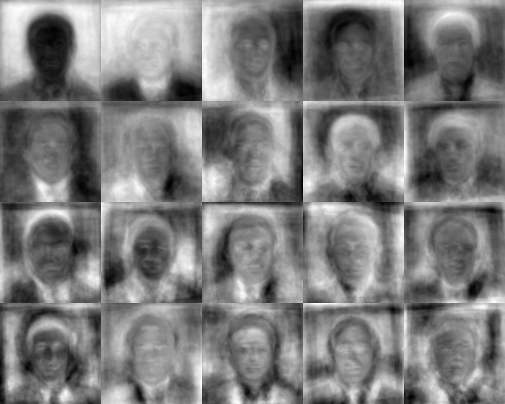

# Eigenfaces — PCA-Based Face Morphing

While studying linear algebra, the idea that a human face can be represented
as a vector in high-dimensional space, and that SVD can extract the principal
directions of variation across a dataset of faces, was very interesting.

I implemented it using NumPy and basic mathematical operations.

The core idea: every face can be expressed as a weighted sum of eigenfaces —
basis vectors that capture how faces vary across a dataset. To morph two faces,
you project both into eigenspace, linearly interpolate between their
coordinates, then reconstruct back to pixel space.

One interesting outcome was the eigenface grid — those ghostly patterns the
algorithm extracts purely from pixel data, with no labels or supervision.
It's a good visual proof that the math is actually working.

## What it does

Takes two face images and smoothly morphs one into the other by navigating
through eigenspace — the mathematical space where faces live.

## Why this is unique

This project implements the full pipeline:
mean-centering, SVD, projection, interpolation, and reconstruction.

## The Math

### 1. Mean Centering

Every face image is flattened into a vector of 4096 numbers (64x64 pixels).
We subtract the mean face from all images to center the data around zero.
This removes lighting bias and focuses on facial structure differences.

### 2. Singular Value Decomposition (SVD)

Instead of computing a giant 4096x4096 covariance matrix, we apply SVD
directly on the centered data matrix:

X = U Σ Vᵀ

The rows of Vᵀ are our eigenfaces — the principal directions of variation
across all faces in the dataset.

### 3. Eigenspace Projection

Each face is projected onto the top 300 eigenfaces:

coords = Eᵀ × (face - mean)

This compresses a 4096-dimensional face into just 300 numbers — its
coordinates in eigenspace.

### 4. Interpolation

To morph face A into face B, we linearly interpolate between their coordinates:

interpolated = (1 - t) × coordsA + t × coordsB

Where t goes from 0 to 1 across 60 frames.

### 5. Reconstruction

Each interpolated coordinate is projected back to pixel space:

reconstructed = E × coords + mean

The blur represents the reconstruction error of using only 300 out of 4096
possible components. This is the dimensionality reduction tradeoff at work.

## Results

### Eigenfaces (what PCA learned)

### Face Morphing

How to Run

Download the LFW (Labeled Faces in the Wild) dataset
Place it in the project folder as lfw_funneled
Install dependencies:

   pip install numpy opencv-python pillow

Run:

   python main.py

## Tech Stack

* Python
* NumPy (all math + SVD)
* OpenCV (image loading only)
* Pillow (GIF generation)
